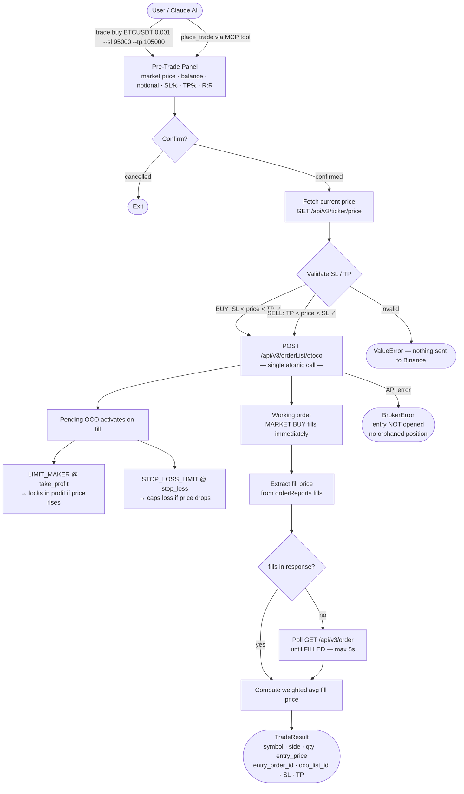
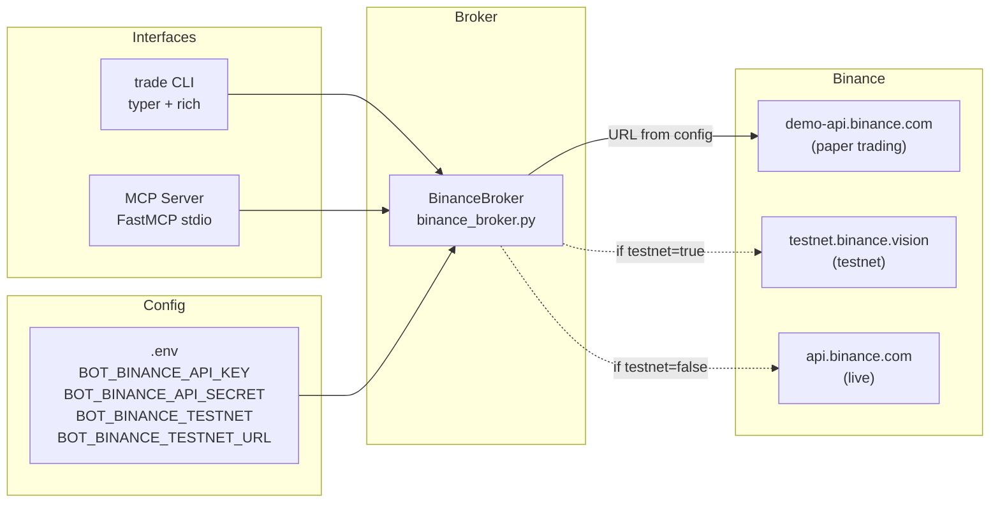
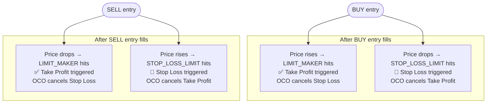
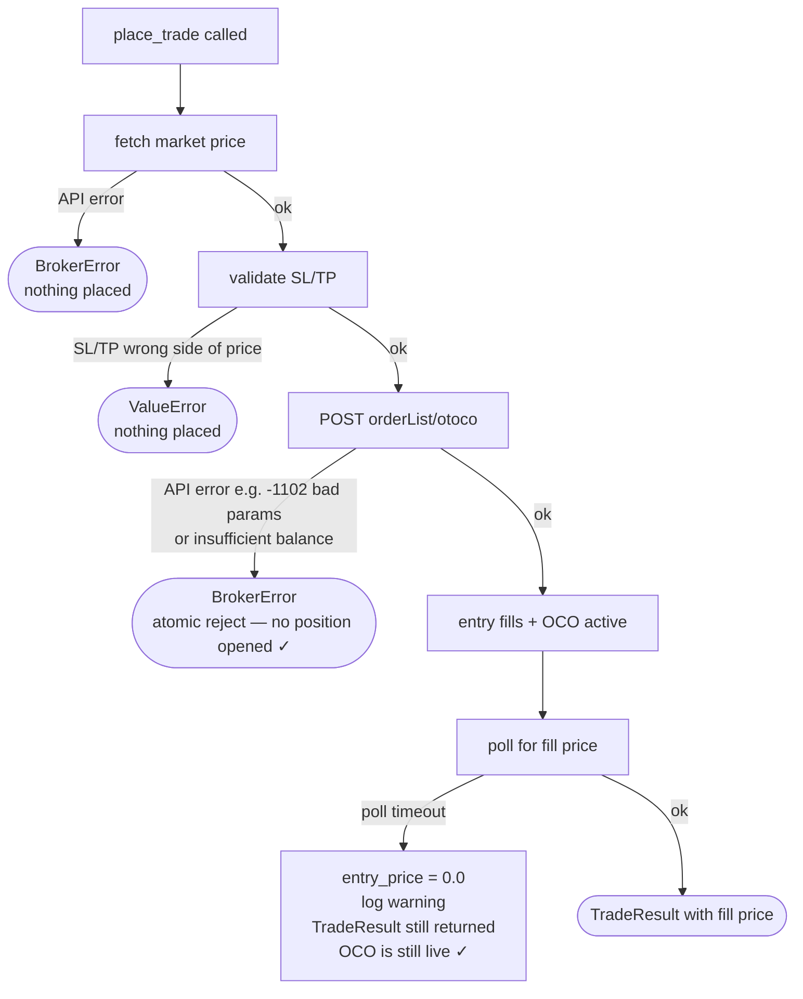

# Trade Execution Flow

## 1. End-to-End: From Command to Filled Trade

```mermaid
flowchart TD
    A([User / Claude AI]) -->|"trade buy BTCUSDT 0.001 --sl 95000 --tp 105000"| B
    A -->|"place_trade via MCP tool"| B

    B[Pre-Trade Panel\nmarket price · balance · notional · SL% · TP% · R:R]
    B --> C{Confirm?}
    C -- cancelled --> Z([Exit])
    C -- confirmed --> D

    D[Fetch current price\nGET /api/v3/ticker/price]
    D --> E{Validate SL / TP}

    E -- "BUY: SL < price < TP ✓" --> F
    E -- "SELL: TP < price < SL ✓" --> F
    E -- invalid --> ERR1([ValueError — nothing sent to Binance])

    F["POST /api/v3/orderList/otoco\n— single atomic call —"]

    F --> G["Working order\nMARKET BUY fills immediately"]
    F --> H["Pending OCO activates on fill"]

    H --> TP["LIMIT_MAKER @ take_profit\n→ locks in profit if price rises"]
    H --> SL["STOP_LOSS_LIMIT @ stop_loss\n→ caps loss if price drops"]

    G --> I[Extract fill price\nfrom orderReports fills]
    I --> J{fills in response?}
    J -- yes --> K[Compute weighted avg fill price]
    J -- no --> L[Poll GET /api/v3/order\nuntil FILLED — max 5s]
    L --> K

    K --> M([TradeResult\nsymbol · side · qty · entry_price\nentry_order_id · oco_list_id · SL · TP])

    F -- "API error" --> ERR2(["BrokerError\nentry NOT opened\nno orphaned position"])
```

---

## 2. System Architecture

```mermaid
flowchart LR
    subgraph Interfaces
        CLI["trade CLI\ntyper + rich"]
        MCP["MCP Server\nFastMCP stdio"]
    end

    subgraph Broker
        BB["BinanceBroker\nbinance_broker.py"]
    end

    subgraph Config
        ENV[".env\nBOT_BINANCE_API_KEY\nBOT_BINANCE_API_SECRET\nBOT_BINANCE_TESTNET\nBOT_BINANCE_TESTNET_URL"]
    end

    subgraph Binance
        DEMO["demo-api.binance.com\n(paper trading)"]
        TESTNET["testnet.binance.vision\n(testnet)"]
        LIVE["api.binance.com\n(live)"]
    end

    CLI --> BB
    MCP --> BB
    ENV --> BB
    BB -->|"URL from config"| DEMO
    BB -.->|"if testnet=true"| TESTNET
    BB -.->|"if testnet=false"| LIVE
```

---

## 3. OCO Logic — Which Leg Does What

```mermaid
flowchart TD
    subgraph "After BUY entry fills"
        P1["Price rises → LIMIT_MAKER hits\n✅ Take Profit triggered\nOCO cancels Stop Loss"]
        P2["Price drops → STOP_LOSS_LIMIT hits\n🛑 Stop Loss triggered\nOCO cancels Take Profit"]
    end

    subgraph "After SELL entry fills"
        P3["Price drops → LIMIT_MAKER hits\n✅ Take Profit triggered\nOCO cancels Stop Loss"]
        P4["Price rises → STOP_LOSS_LIMIT hits\n🛑 Stop Loss triggered\nOCO cancels Take Profit"]
    end

    BUY([BUY entry]) --> P1 & P2
    SELL([SELL entry]) --> P3 & P4
```

---

## 4. Error Scenarios

```mermaid
flowchart TD
    A[place_trade called] --> B[fetch market price]

    B -- "API error" --> E1(["BrokerError\nnothing placed"])

    B -- ok --> C[validate SL/TP]
    C -- "SL/TP wrong side of price" --> E2(["ValueError\nnothing placed"])

    C -- ok --> D["POST orderList/otoco"]
    D -- "API error e.g. -1102 bad params\nor insufficient balance" --> E3(["BrokerError\natomic reject — no position opened ✓"])

    D -- ok --> F[entry fills + OCO active]
    F --> G[poll for fill price]
    G -- "poll timeout" --> H["entry_price = 0.0\nlog warning\nTradeResult still returned\nOCO is still live ✓"]
    G -- ok --> I([TradeResult with fill price])
```
