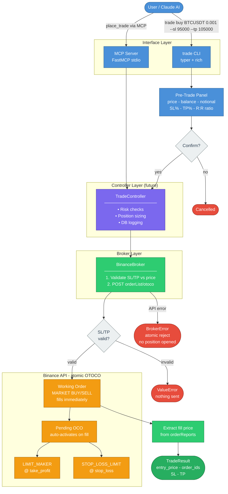
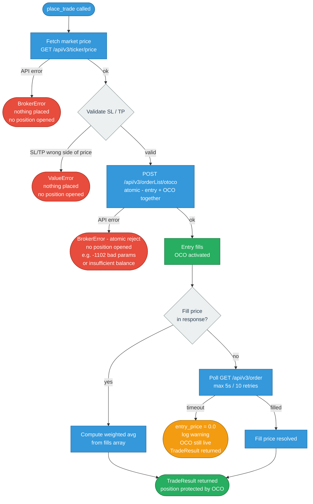

# Trade Execution Flow Diagrams

---

## 1. End-to-End Trade Flow

```mermaid
flowchart TD
    classDef interface fill:#4a90d9,stroke:#2c5f8a,color:#fff
    classDef controller fill:#7b68ee,stroke:#4b3ba0,color:#fff
    classDef broker fill:#2ecc71,stroke:#1a7a43,color:#fff
    classDef binance fill:#f39c12,stroke:#9a6208,color:#fff
    classDef decision fill:#ecf0f1,stroke:#7f8c8d,color:#2c3e50
    classDef error fill:#e74c3c,stroke:#922b21,color:#fff
    classDef success fill:#27ae60,stroke:#1a6b3b,color:#fff

    USER(["User / Claude AI"]):::interface

    subgraph INTERFACE ["Interface Layer"]
        CLI["trade CLI\ntyper + rich"]:::interface
        MCP["MCP Server\nFastMCP stdio"]:::interface
    end

    subgraph CTRL ["Controller Layer (future)"]
        direction TB
        CTRL_NODE["TradeController\n─────────────────\n• Risk checks\n• Position sizing\n• DB logging"]:::controller
    end

    subgraph BROKER_LAYER ["Broker Layer"]
        BB["BinanceBroker\n─────────────────\n1. Validate SL/TP vs price\n2. POST orderList/otoco"]:::broker
    end

    subgraph BINANCE ["Binance API - atomic OTOCO"]
        direction LR
        MARKET["Working Order\nMARKET BUY/SELL\nfills immediately"]:::binance
        OCO["Pending OCO\nauto-activates on fill"]:::binance
        TP_LEG["LIMIT_MAKER\n@ take_profit"]:::binance
        SL_LEG["STOP_LOSS_LIMIT\n@ stop_loss"]:::binance
        OCO --> TP_LEG
        OCO --> SL_LEG
    end

    PANEL["Pre-Trade Panel\nprice - balance - notional\nSL% - TP% - R:R ratio"]:::interface
    CONFIRM{"Confirm?"}:::decision
    VALIDATE{"SL/TP\nvalid?"}:::decision
    FILL["Extract fill price\nfrom orderReports"]:::broker
    RESULT(["TradeResult\nentry_price - order_ids\nSL - TP"]):::success

    ERR_CANCEL(["Cancelled"]):::error
    ERR_VALIDATE(["ValueError\nnothing sent"]):::error
    ERR_API(["BrokerError\natomic reject\nno position opened"]):::error

    USER -->|"trade buy BTCUSDT 0.001 --sl 95000 --tp 105000"| CLI
    USER -->|"place_trade via MCP"| MCP
    CLI --> PANEL
    MCP --> CTRL_NODE
    PANEL --> CONFIRM
    CONFIRM -->|"no"| ERR_CANCEL
    CONFIRM -->|"yes"| CTRL_NODE
    CTRL_NODE --> BB
    BB --> VALIDATE
    VALIDATE -->|"invalid"| ERR_VALIDATE
    VALIDATE -->|"valid"| MARKET
    MARKET --> OCO
    MARKET --> FILL
    BB -->|"API error"| ERR_API
    FILL --> RESULT
```

---

## 2. System Architecture

```mermaid
architecture-beta
    group interface_layer(internet)[Interface Layer]
        service cli(server)[trade CLI - typer + rich] in interface_layer
        service mcp(server)[MCP Server - FastMCP stdio] in interface_layer

    group controller_layer(cloud)[Controller Layer - future]
        service controller(server)[TradeController - risk + sizing + DB log] in controller_layer

    group broker_layer(server)[Broker Layer]
        service broker(server)[BinanceBroker] in broker_layer
        service config(disk)[.env Config - BOT_ vars] in broker_layer

    group binance_grp(internet)[Binance Endpoints]
        service demo(server)[demo-api.binance.com - paper trading] in binance_grp
        service testnet(server)[testnet.binance.vision - testnet] in binance_grp
        service live(server)[api.binance.com - live] in binance_grp

    cli:R --> L:controller
    mcp:R --> L:controller
    controller:R --> L:broker
    config:T --> B:broker
    broker:R --> L:demo
    broker:R --> L:testnet
    broker:R --> L:live

    align column cli mcp
    align column demo testnet live
```

---

## 3. OCO Leg Logic — Which Leg Fires When

```mermaid
flowchart LR
    classDef entry fill:#3498db,stroke:#1a6091,color:#fff
    classDef tp fill:#27ae60,stroke:#1a6b3b,color:#fff
    classDef sl fill:#e74c3c,stroke:#922b21,color:#fff
    classDef cancel fill:#95a5a6,stroke:#616a6b,color:#fff

    BUY_ENTRY(["BUY entry filled\nlong position open"]):::entry
    SELL_ENTRY(["SELL entry filled\nshort position"]):::entry

    subgraph BUY_OCO ["OCO protecting a LONG"]
        direction TB
        BUY_TP["Price rises\nhits LIMIT_MAKER @ take_profit\nProfit locked in"]:::tp
        BUY_SL["Price drops\nhits STOP_LOSS_LIMIT @ stop_loss\nLoss capped"]:::sl
        BUY_TP -->|"cancels"| BUY_SL_CANCEL["SL cancelled"]:::cancel
        BUY_SL -->|"cancels"| BUY_TP_CANCEL["TP cancelled"]:::cancel
    end

    subgraph SELL_OCO ["OCO protecting a SHORT"]
        direction TB
        SELL_TP["Price drops\nhits LIMIT_MAKER @ take_profit\nProfit locked in"]:::tp
        SELL_SL["Price rises\nhits STOP_LOSS_LIMIT @ stop_loss\nLoss capped"]:::sl
        SELL_TP -->|"cancels"| SELL_SL_CANCEL["SL cancelled"]:::cancel
        SELL_SL -->|"cancels"| SELL_TP_CANCEL["TP cancelled"]:::cancel
    end

    BUY_ENTRY --> BUY_TP
    BUY_ENTRY --> BUY_SL
    SELL_ENTRY --> SELL_TP
    SELL_ENTRY --> SELL_SL
```

---

## 4. Error Scenarios

```mermaid
flowchart TD
    classDef normal fill:#3498db,stroke:#1a6091,color:#fff
    classDef decision fill:#ecf0f1,stroke:#7f8c8d,color:#2c3e50
    classDef error fill:#e74c3c,stroke:#922b21,color:#fff
    classDef warn fill:#f39c12,stroke:#9a6208,color:#fff
    classDef success fill:#27ae60,stroke:#1a6b3b,color:#fff

    START(["place_trade called"]):::normal

    FETCH["Fetch market price\nGET /api/v3/ticker/price"]:::normal
    FETCH_ERR(["BrokerError\nnothing placed\nno position opened"]):::error

    VALIDATE{"Validate SL / TP"}:::decision
    VAL_ERR(["ValueError\nnothing placed\nno position opened"]):::error

    OTOCO["POST /api/v3/orderList/otoco\natomic - entry + OCO together"]:::normal
    OTOCO_ERR(["BrokerError - atomic reject\nno position opened\ne.g. -1102 bad params\nor insufficient balance"]):::error

    FILLED["Entry fills\nOCO activated"]:::success

    POLL{"Fill price\nin response?"}:::decision
    POLL_YES["Compute weighted avg\nfrom fills array"]:::normal
    POLL_RETRY["Poll GET /api/v3/order\nmax 5s / 10 retries"]:::normal
    POLL_TIMEOUT(["entry_price = 0.0\nlog warning\nOCO still live\nTradeResult returned"]):::warn
    POLL_OK["Fill price resolved"]:::normal

    RESULT(["TradeResult returned\nposition protected by OCO"]):::success

    START --> FETCH
    FETCH -->|"API error"| FETCH_ERR
    FETCH -->|"ok"| VALIDATE
    VALIDATE -->|"SL/TP wrong side of price"| VAL_ERR
    VALIDATE -->|"valid"| OTOCO
    OTOCO -->|"API error"| OTOCO_ERR
    OTOCO -->|"ok"| FILLED
    FILLED --> POLL
    POLL -->|"yes"| POLL_YES
    POLL -->|"no"| POLL_RETRY
    POLL_RETRY -->|"timeout"| POLL_TIMEOUT
    POLL_RETRY -->|"filled"| POLL_OK
    POLL_YES --> RESULT
    POLL_OK --> RESULT
```
