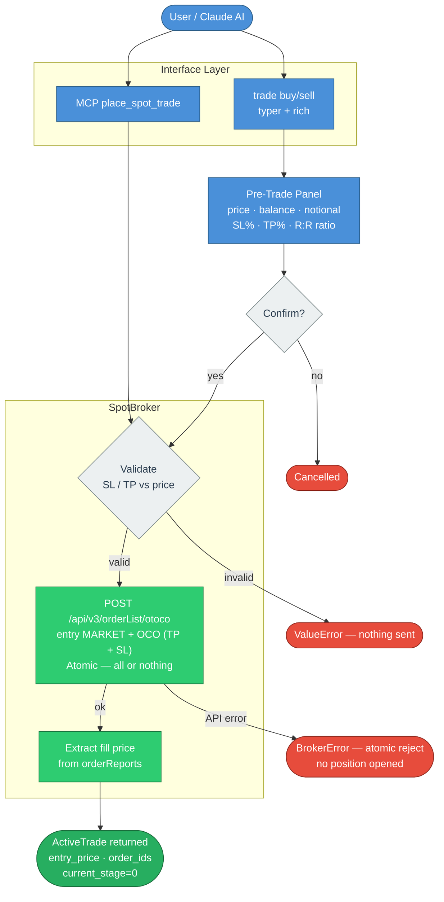
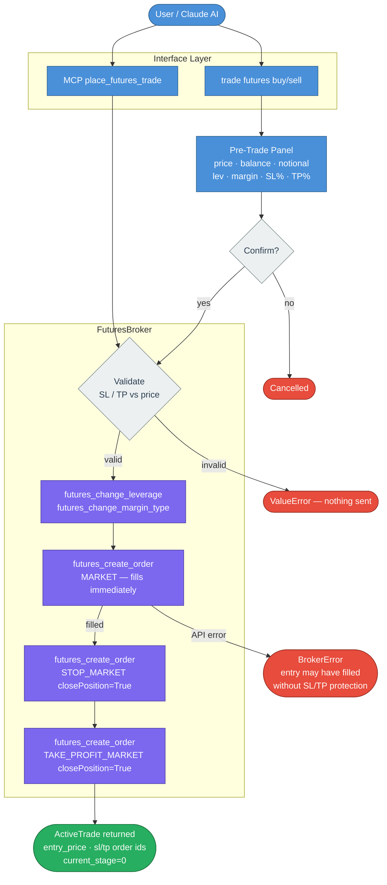
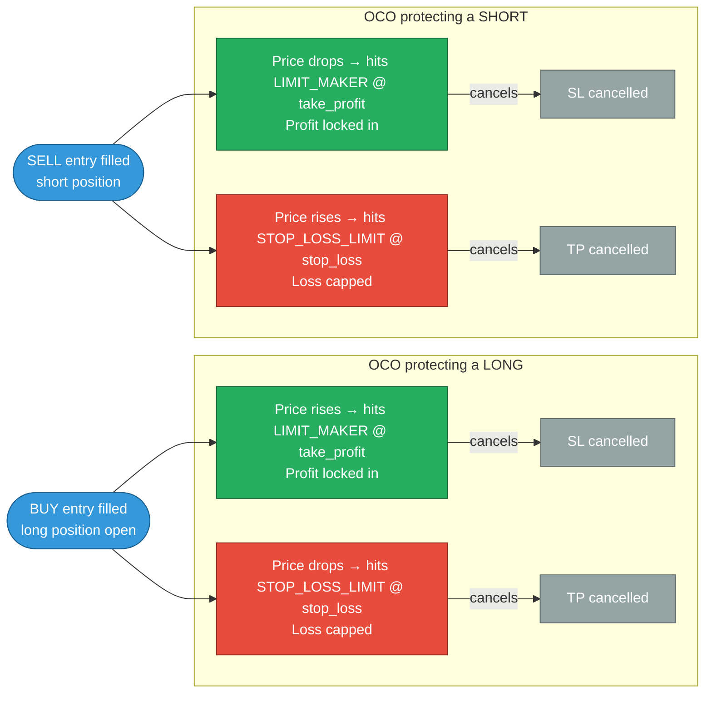
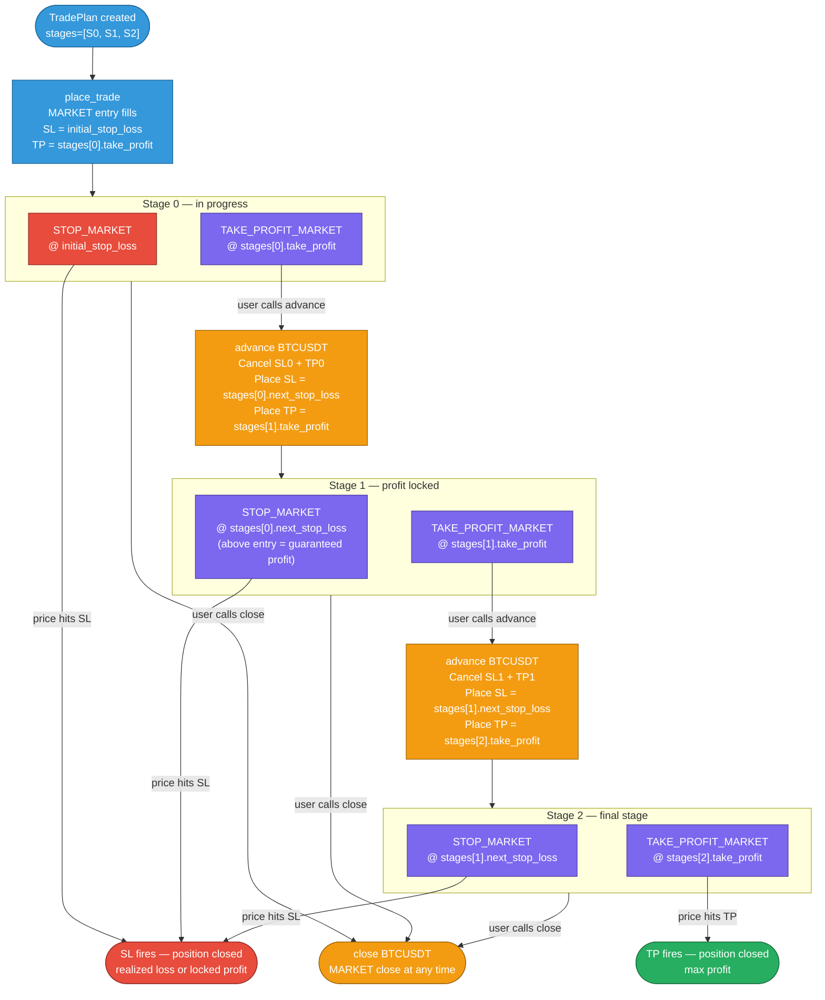
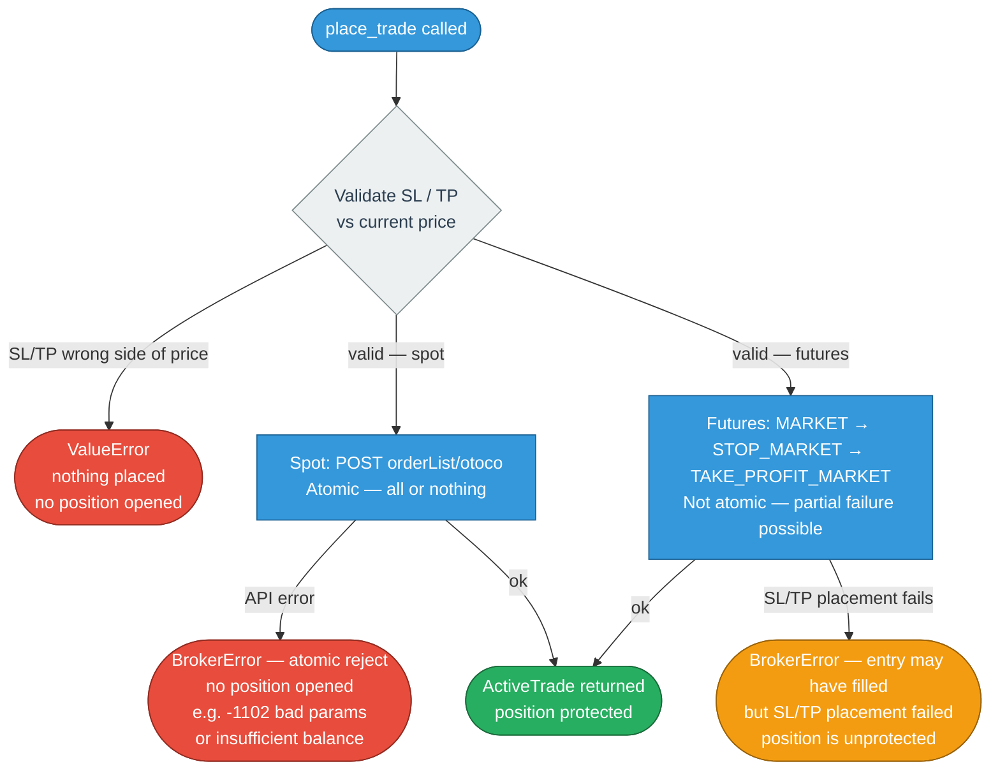

# Trade Execution Flow Diagrams

> Last updated: 2026-06-30. Reflects `SpotBroker` + `FuturesBroker` ports-and-adapters architecture.

---

## 1. System Architecture

---

## 2. Spot Trade Execution Flow

Spot uses a single atomic OTOCO order (entry MARKET + OCO with LIMIT_MAKER TP + STOP_LOSS_LIMIT SL).

---

## 3. Futures Trade Execution Flow

Futures places **three separate orders**: MARKET entry, then STOP_MARKET SL, then TAKE_PROFIT_MARKET TP (each with `closePosition=True`). Leverage and margin type are set first.

---

## 4. Spot OCO Leg Logic — Which Leg Fires When

---

## 5. Multi-Stage Futures Trade Lifecycle

A trade can have N stages. Each stage has its own TP and the next stage's SL. Calling `advance` locks in profit by moving the SL above entry.

---

## 6. Error Scenarios

